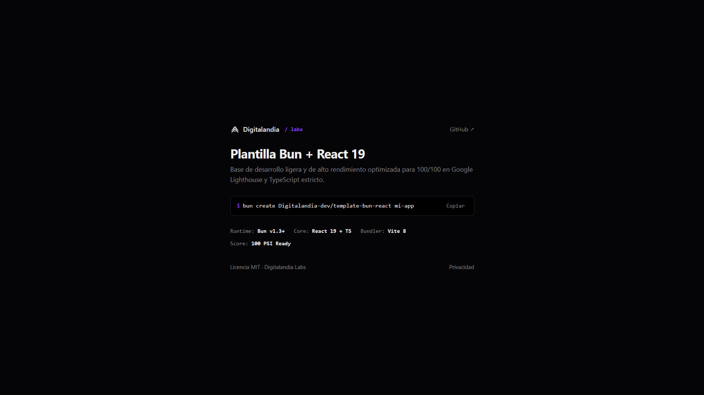

# Template Bun + React 19

Base de desarrollo ultraligera, minimalista y de alto rendimiento diseñada por **[Digitalandia Labs](https://digitalandia.com/labs)** para crear aplicaciones web con puntuación perfecta (100/100) en Google Lighthouse.

<p align="left">
  <a href="https://template.digitalandia.com/" target="_blank" rel="noopener noreferrer">
    
  </a>
  <a href="https://pagespeed.web.dev/analysis?url=https%3A%2F%2Ftemplate.digitalandia.com%2F" target="_blank" rel="noopener noreferrer">
    
  </a>
  
  
</p>



---

## Inicio Rapido

Para inicializar un nuevo proyecto utilizando Bun:

```bash
# 1. Crear el proyecto desde la plantilla
bun create Digitalandia-dev/template-bun-react mi-proyecto

# 2. Entrar al directorio
cd mi-proyecto

# 3. Instalar dependencias
bun install

# 4. Iniciar servidor de desarrollo
bun run dev
```

El servidor local estara disponible en `http://localhost:5173`.

---

## Caracteristicas Tecnicas

* **Rendimiento (100/100 Lighthouse)**: Inyeccion automatica de CSS critico en el `<head>` durante la fase de compilacion para eliminar el bloqueo de renderizado inicial.
* **React 19 y Vite 8**: Compatibilidad completa con la version mas reciente de React y arquitectura ESM rapida con Vite.
* **TypeScript Estricto**: Tipado riguroso sin uso de `any` para garantizar mantenibilidad y robustez de codigo.
* **Enrutamiento Nativo**: Sistema de navegacion integrado sin dependencias externas, con soporte para botones de historial del navegador, pagina 404 y Politica de Privacidad.
* **SEO y GEO Preparado**: Configuracion base con metadatos Open Graph, Twitter Cards, `robots.txt`, `sitemap.xml` y `llms.txt` para indexacion en buscadores y modelos de lenguaje.
* **Sin Rastreadores**: Codigo limpio sin telemetria ni dependencias ocultas.

---

## Estructura del Proyecto

```text
.
|-- public/
|   |-- favicon.svg          # Favicon vectorial
|   |-- logo.svg             # Isotipo de la marca
|   |-- image.png            # Imagen de previsualizacion / OG Image
|   |-- llms.txt             # Documentacion para modelos de IA
|   |-- robots.txt           # Reglas para motores de busqueda
|   `-- sitemap.xml          # Mapa de rutas del sitio
|-- src/
|   |-- pages/
|   |   |-- NotFound.tsx      # Pagina de error 404
|   |   `-- PrivacyPolicy.tsx # Pagina de politica de privacidad
|   |-- hooks/
|   |   `-- useScrollReveal.ts# Hook nativo de animacion por scroll
|   |-- App.tsx              # Componente principal y enrutador
|   |-- index.css            # Sistema de diseno minimalista en CSS puro
|   `-- main.tsx             # Punto de entrada de la aplicacion
|-- scripts/
|   |-- inline-css.js        # Script de post-procesamiento para inlining de CSS
|   `-- optimize-images.js   # Script de conversion de imagenes a WebP
|-- vite.config.ts           # Configuracion del bundler y plugins
|-- tsconfig.json            # Configuracion del compilador TypeScript
|-- LICENSE                  # Licencia MIT
|-- package.json             # Dependencias y scripts del proyecto
`-- README.md                # Documentacion principal
```

---

## Scripts Disponibles

| Comando | Descripcion |
| :--- | :--- |
| `bun run dev` | Inicia el entorno de desarrollo local con recarga rapida (HMR). |
| `bun run build` | Compila TypeScript, empaqueta con Vite e inyecta el CSS critico en `dist/index.html`. |
| `bun run preview` | Inicia un servidor local para inspeccionar la compilacion de produccion. |
| `bun run generate-favicons` | Genera suite de favicons multi-resolución (16x16, 32x32, 48x48, ICO, Apple Touch) desde `favicon.svg`. |
| `bun run optimize-images` | Procesa y optimiza imagenes en lote al formato WebP. |
| `bun run lint` | Ejecuta el linter estatico para comprobar reglas de React y TypeScript. |

---

## Personalizacion

1. **Identidad Visual**: Sustituye los archivos `public/logo.svg` y `public/favicon.svg` por los vectores de tu marca.
2. **Sistema de Diseno**: Ajusta las variables CSS en `src/index.css` (`--bg`, `--accent`, `--text`, `--border`).
4. **Analíticas**: Por defecto la web utiliza **Umami Analytics** (configurado en `index.html`). Si prefieres o requieres Google Analytics 4, se incluye el componente opcional `<GoogleAnalytics />` en `src/components/GoogleAnalytics.tsx` con carga diferida inteligente (0 ms TBT, 100/100 PSI) configurando `VITE_GA_ID` en `.env`.

---

## Licencia

Este proyecto esta licenciado bajo los terminos de la licencia [MIT](LICENSE).

Desarrollado por **[Digitalandia Labs](https://digitalandia.com/labs)**.
